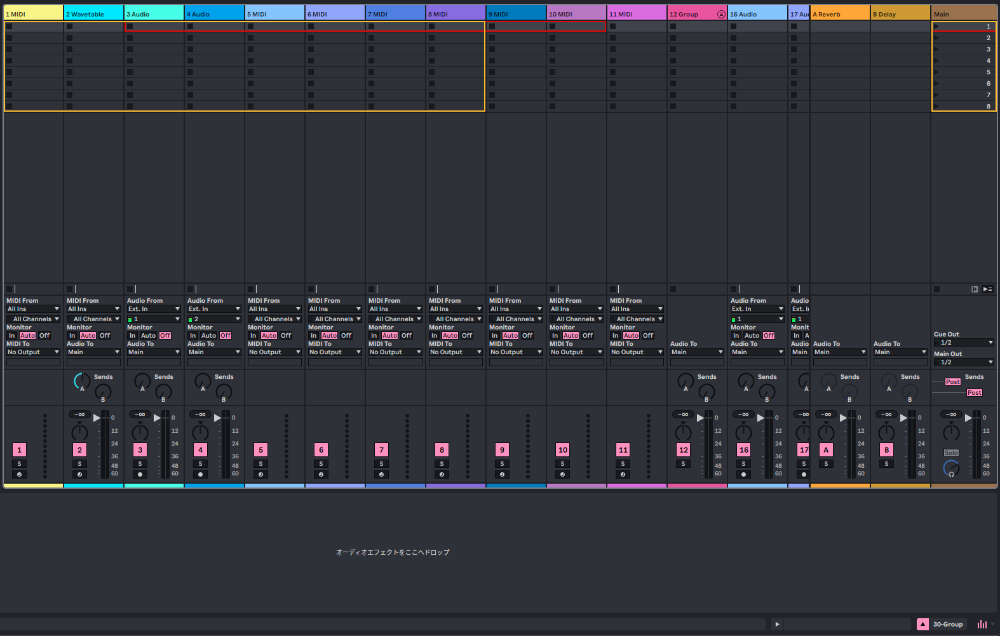

# LaunchControlXL_SessionBox

Novation Launch Control XL 用の Ableton Live 12 カスタム MIDI Remote Script。
セッションビューのハイライトボックス表示、ミキサー制御、デバイスパラメータ制御を実装。



## 機能

### ミキサー制御
- フェーダー: トラックボリューム
- ノブ Row 1: Send A（Deviceモード時はデバイスパラメータ 1-8）
- ノブ Row 2: Send B
- ノブ Row 3: Pan

### セッションビュー
- ハイライトボックス（選択範囲）を表示
- Track Select 左右: セッションボックスの移動
- Send Select 上下: シーンの移動
- グループトラック折りたたみ対応（visible_tracks）

### ボタン
- Track Focus: トラック選択
- Track Control: Mute / Solo / Record Arm（サイドボタンでモード切替）

### デバイス制御
- Device ボタンタップ: デバイスモードの ON/OFF（Send A行がデバイスパラメータに切替）
- Device ホールド + Track Select 左右: デバイス切替

### LED フィードバック
- ノブ LED: トラックカラー表示（デバイスモード時はアンバー）
- Track Focus: 選択中は明るいアンバー、非選択は暗い赤
- Track Control:
  - Mute モード: ミュート時は消灯、非ミュート時は明るいアンバー
  - Solo モード: ソロ時はグリーン、非ソロ時は消灯
  - Record Arm モード: アーム時はレッド、非アーム時は消灯
- Track Select 左右: 移動可能な方向が点灯
- サイドボタン: アクティブモードが点灯

## 配置方法

1. `__init__.py` と `LaunchControlXL_SessionBox.py` を以下のディレクトリにコピー:

```
~/Music/Ableton/User Library/Remote Scripts/LaunchControlXL_SessionBox/
```

2. Ableton Live を起動（または再起動）
3. `Preferences` > `Link, Tempo & MIDI` > `Control Surface` で `LaunchControlXL_SessionBox` を選択
4. Input / Output に `Launch Control XL` を設定

## ブランチ

- `main` - 安定版（8トラック均等、DeviceComponent使用）
- `feature/master-on-column-8` - 8列目をマスタートラックに固定（列1〜7がセッションボックス、列8は常にマスターのボリューム・Pan・Send・Solo を操作）
- `experimental/direct-param-mapping` - 実験版（Live.MidiMap.map_midi_cc で24パラメータ直接マッピング）

## 要件

- Ableton Live 12
- Novation Launch Control XL（Factory Template使用、MIDI Channel 9）
